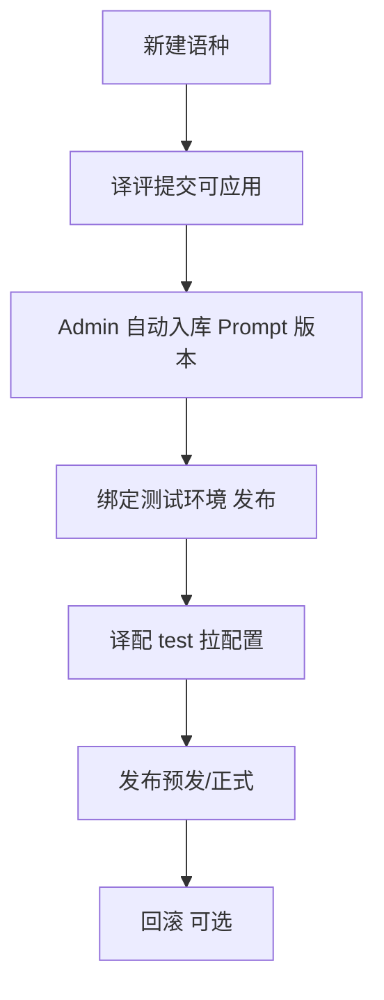

# PRD · Admin 管理平台 · 一期

> **文档版本**：v1.14 · 2026-06（PRD 修订号，见文末变更说明）  
> 关联文档：《一期功能清单》《双平台功能列表-一期》《PRD-译评平台-一期》  
> **文件路径**：`AI 译评平台 & Admin/需求文档/PRD-Admin管理平台-一期.md`  
> **交互原型**：`AI 译评平台 & Admin/eval-prototype/`（发布管理区块已合并；`prototype/` 跳转）

---

## 0. 产品决策（已确认）

| # | 决策 | 结论 |
|---|------|------|
| 1 | 过线 / Gate | **译评侧拦截**：仅专家在译评标为 **可用** 的版本可提交 Admin；**Admin 一期不展示、不校验 `gate_result`**（可选入库字段） |
| 2 | Prompt 槽位 | **沿用当前定义**：`system` / `name_mapping` / `engineering`（与译评、译配一致） |
| 3 | 登录 / 权限 | **一期不做**；内网/VPN；发布时填操作人姓名 |
| 4 | 版本内容来源 | 接收译评提交为主；Markdown 与编辑器为译评侧双入口，Admin 只存块内容 |
| 5 | 译配如何拿新 Prompt | **消息通知（主）+ 轮询（兜底）**；均配合本地缓存 + etag，详见 §7.2.4 |
| 6 | 访问方式 | **仅公司内网 VPN**；服务不对公网暴露；一期不做登录 |
| 7 | 管理 Web UI | 以 §7.2.6 为准（已评审 HTML 原型）；列表/详情字段与交互与原型一致 |
| 8 | 译评提交入库 | **自动入库**：译评「提交可应用」成功后，Admin **Prompt 版本**列表立即可见；**无**待接收队列、**无**人工确认入库 |
| 9 | 产品形态 | **一个工作台、三模块（人校评阅一期仅占位）、两块后端**：本 PRD 能力归属 **发布管理** + **配置服务**；规则评测/人校评阅见译评 PRD；统一 IA 见《双平台功能列表》§1 |
| 10 | 产品命名 | 工作台 **AI 译评工作台**；模块 **规则评测** / **人校评阅**（占位）/ **发布管理**；本 PRD 对应 **发布管理** |

---

## 1. Summary

**发布管理模块**（原 Admin 管理平台）一期是**全新建设**，用于把 Prompt 从代码工程中解耦：管理语种生命周期、维护 Prompt 版本库、在**测试 / 预发 / 正式**三环境绑定并发布 Prompt，并通过配置 API 供 AI 译配运行时拉取。**一期不做登录与权限**（已确认），面向内网/VPN 可信环境。  
**产品形态**：侧栏含 **规则评测** / **人校评阅**（占位）/ **发布管理**（`#/config`）；本 PRD 覆盖 **发布管理**。**配置服务** 与 **迭代服务** 分库分部署。

---

## 2. Contacts

| 角色 | 姓名 | 职责 |
|------|------|------|
| 产品 | （待填） | 需求、验收、发布流程拍板 |
| 管理平台 | 张小飞、李姝宜 | 平台 Owner、排期 |
| 译配接入 | 张雨时、张健 | 测试/预发/正式配置化接入 |
| 译评对接 | （待填） | 候选版本提交 API 联调 |
| 研发 | （待填） | Admin 后端 + Web + 配置 API |

---

## 3. Background

### 3.1 背景

当前新语种 Prompt 上线依赖研发改代码、发版，周期长且难回滚。译评平台已能产出评测报告与 Prompt 迭代，但缺少统一的**版本库与环境发布**层。

Admin 定位为 **Prompt 与语种配置的单一事实来源（SSOT）**：

- 译评：写 Prompt、评测、提交**过线候选**  
- Admin：入库、绑定环境、发布/回滚  
- 译配：按环境读配置，不再硬编码 Prompt  

### 3.2 为什么现在做

1. 新语种 SOP 阶段 3 明确 **Admin 配置化接入**（@张雨时 @张健）；预发/正式发布纳入同一阶段运维动作，**不单列 SOP 阶段 4**。  
2. 译评平台一期将提交候选版本，Admin 必须能接收并发布。  
3. 多语种、多环境并行扩张，继续靠发版改 Prompt 不可持续。

### 3.3 一期边界

**Admin 负责**：语种壳子、Prompt 版本库、三环境发布、配置 API、最小 Web。  
**Admin 不负责**：写 Prompt、跑评测、PE 编辑、登录/审批、译配业务功能。

---

## 4. Objective

### 4.1 目标

建设最小可用的 Admin，使：

- 运营/研发可在 Web 上管理语种状态与 Prompt 版本；  
- 译评过线版本可**自动入库**；  
- 测试/预发/正式各环境**一键绑定 Prompt 并回滚**；  
- 译配运行时通过 API 获取当前生效 Prompt。

### 4.2 业务价值

| 对象 | 收益 |
|------|------|
| 研发 | 新语种 Prompt 上线不改代码 |
| 语种专家 | 过线版本有正式「发布」路径 |
| 业务 | 预发/正式切换 ≤ 1 次操作，可回滚 |
| 公司 | 配置可追溯（谁、何时、哪版本、哪环境） |

### 4.3 关键结果（KR）

| KR | 指标 | 目标 |
|----|------|------|
| KR1 | 新语种 Prompt 上测试环境 | 零代码发版，Admin 发布即可 |
| KR2 | 发布操作 | 预发/正式切换 ≤ 1 次 Admin 操作 |
| KR3 | 回滚 | 任意环境 ≤ 1 分钟内切回上一版本（配置生效，不含译配缓存延迟） |
| KR4 | 版本追溯 | 100% 发布记录含操作人、时间、版本 ID |
| KR5 | 译配拉配置 | API 可用性 ≥ 99.9%（内网 SLA 试点） |

---

## 5. Market Segment(s)

### 5.1 主要用户

| 用户 | 场景 | 约束 |
|------|------|------|
| **平台运营 / 研发** | 建语种、收候选、发测试/预发/正式 | 内网访问；一期无账号体系 |
| **译评平台（系统）** | 提交过线 Prompt | 调用 REST API |
| **译配运行时（系统）** | 拉 Prompt 配置 | 高可用、可缓存 |
| **语种专家（只读）** | 查看当前各环境生效版本 | 可选；一期可仅研发操作 |

### 5.2 约束

- **安全**：**仅 VPN 内网访问**（已确认）；不对公网开放；一期无登录 → 发布时必填操作人姓名。
- **环境**：固定三环境 `test` | `staging` | `production`。  
- **语种**：与译评共用 `admin_language_id` 作为主键对外标识。

---

## 6. Value Proposition(s)

### 6.1 用户任务（JTBD）

> 当译评确认一版 Prompt 过线后，我想在**一个地方**把它发到测试或正式，并让译配自动用到这版 Prompt，这样就不用找研发改代码、发版、还不敢回滚。

### 6.2 价值

| 维度 | 现状 | 一期后 |
|------|------|--------|
| Prompt 上线 | 改代码 + 发版 | Admin 点发布 |
| 版本管理 | 散落 Git / 文档 | 版本库 + changelog + 来源 |
| 多环境 | 手工对齐 | 测试/预发/正式独立绑定 |
| 事故 recovery | 再发版 | 一键回滚上一版本 |
| 评测关联 | 无 | 版本可挂 eval_report_id |

### 6.3 与「只建译评」的差异

Admin 是**生产配置边界**：译评回答「这版好不好」，Admin 回答「哪版在哪个环境生效」。

---

## 7. Solution

### 7.1 用户主流程



### 7.2 功能需求

#### 7.2.1 A-1 · 语种管理

| 需求 ID | 功能 | 描述 | 验收标准 | 优先级 |
|---------|------|------|----------|--------|
| A-1.1 | 语种列表 | **语种**（拼接展示）、语对、**Prompt 应用阶段**、负责人；操作「详情」；列表页标题 **语种管理** | **列表不展示**三环境绑定（见详情）；按阶段筛选为 **P1** | P0 |
| A-1.2 | 新建语种 | **源语言**、**目标语言**、负责人、备注（文本）；**语种名由系统拼接**写入 `display_name`，Web 不手填 | `language_id`=`lang_{target}_{source}`；初始 `status=none`（UI：**无**） | P0 |
| A-1.3 | 阶段流转 | `none` → `testing` → `staging` → `production` → `offline`（字段名仍为 `status`） | 手动切换；可配置「禁止 none 直跳 production」；**一期原型未含 UI** | P1 |
| A-1.4 | 语种详情 | 各环境当前生效 Prompt 版本摘要 | 一眼看到 test/staging/prod 各绑哪版 | P0 |
| A-1.5 | 关联译评 | 展示最近评测任务、过线结论、候选版本 | 只读；数据来自译评或提交 payload | P1 |

**Prompt 应用阶段说明**（列表/UI 统称；库表字段仍为 `status`，勿与部署环境 test/staging/production 混淆）

> Admin **不设「草稿」阶段**。新建语种默认 `status=none`，界面展示 **无**（仅表示尚未进入测试/预发/正式流程）。与译评侧「Prompt 草稿 / 候选」（E-2.3）无关。

| 阶段（`status`） | UI | 含义 | 译配行为 |
|------------------|-----|------|----------|
| `none` | 无 | 刚创建，未设定应用阶段 | 不可用 |
| `testing` | 测试中 | 测试接入中 | 仅 test 环境可拉配置 |
| `staging` | 预发 | 预发验证 | staging + test |
| `production` | 正式 | 正式可用 | 全环境按绑定生效 |
| `offline` | 已下线 | 已下线 | API 返回不可用 |

#### 7.2.2 A-2 · Prompt 版本库

| 需求 ID | 功能 | 描述 | 验收标准 | 优先级 |
|---------|------|------|----------|--------|
| A-2.1 | 版本列表 | 按语种列出：短版本名（如 v1、v2）、来源、入库时间 | 来源：`eval_submit` / `manual`；UI 区名 **Prompt 版本** | P0 |
| A-2.2 | 版本查看 | 分槽位只读展示 `system` / `name_mapping` / `engineering` | 与译评一致；**不做**整篇 Markdown 主视图 | P0 |
| A-2.3 | 译评自动入库 | `POST /v1/prompt-versions/submit` 成功即写入版本表；**Web 无确认步骤** | 提交后 Prompt 版本区立即可见；幂等：同一 `eval_prompt_version_id` 不重复 | P0 |
| A-2.4 | 评测关联 | 存 `eval_task_id`、`eval_report_id`（`gate_result` 可选入库字段，**Web 不展示**） | 版本详情可跳转译评报告（URL 配置） | P0 |
| A-2.5 | 手工录入 | 应急：表单粘贴各块创建版本 | 来源标记 `manual` | P1 |
| A-2.6 | 版本 diff | 任意两版本对比 | 块级 diff | P2 |

**译评提交 · 自动入库（来自译评 E-6.1）**

与《PRD-译评平台-一期》7.2.7 payload 对齐；服务端校验通过后**同步创建** `PromptVersion` 并返回（无需人工确认）：

```json
{
  "admin_prompt_version_id": "apv-789",
  "status": "accepted"
}
```

#### 7.2.3 A-3 · 环境与应用发布

| 需求 ID | 功能 | 描述 | 验收标准 | 优先级 |
|---------|------|------|----------|--------|
| A-3.1 | 环境定义 | 固定 `test`、`staging`、`production` | 不可删；可扩展预留 | P0 |
| A-3.2 | 环境绑定 | 每语种 × 每环境 → 当前 `admin_prompt_version_id` | 未绑定返回明确错误 | P0 |
| A-3.3 | 发布 | 将指定版本应用到指定环境 | 写发布历史；更新绑定 | P0 |
| A-3.4 | 回滚 | 切回该环境**上一生效版本** | 无上一版时报错提示 | P0 |
| A-3.5 | 发布历史 | 时间、操作人、语种、环境、版本 ID、动作 publish/rollback | 可按语种/环境筛选 | P0 |
| A-3.6 | 发布前校验 | **一期不做**（过线由译评提交前保证）；二期可按需加阻断 | — | P2 |

**发布操作 UI（最小 · 对齐原型）**

语种**详情单页**（非三个独立 Tab 页），包含：

1. **三环境概览**（测试 / 预发 / 正式）：当前版本、生效时间、操作人（各一张卡片）  
2. **环境发布表**：列 = 环境｜当前版本｜生效时间｜操作人｜更换版本（下拉）+ 发布 + 回滚  
3. 环境名称 **仅中文展示**；API/库表仍为 `test` / `staging` / `production`  
4. 发布/回滚 → 弹窗 **必填操作人**（A-5.4）  

#### 7.2.4 A-4 · 译配拉配置 & 获取新 Prompt

**原则**：消息为主、轮询兜底，两种都要做；不要只选一种。

```
Admin 发布 / 回滚
       │
       ├─① 发消息（主路径，目标 ≤10s 生效）
       │
       └─② 译配本地有缓存 + etag

译配运行时
       │
       ├─ 收到消息 → 清缓存 → 调 API 拉新 Prompt
       │
       └─ 定时轮询（兜底，5–15min）→ 带 etag 问 Admin
              ├─ 有变更 → 拉新 Prompt
              └─ 无变更 → 304，继续用缓存
```

**Admin 侧（P0）**

| 需求 ID | 做什么 |
|---------|--------|
| A-4.1 | 提供拉 Prompt 接口：`GET /v1/config/prompt?language_id=&env=` |
| A-4.2 | 语种下线 / `status=none` 时返回不可用 |
| A-4.3 | 响应带 `etag`；支持 `If-None-Match`，未变返回 **304** |
| A-4.4 | **发布 / 回滚成功后发一条消息**（接公司现有 MQ 即可，研发选型） |
| A-4.5 | 健康检查 `GET /health` |

**译配侧（P0，@张雨时 @张健）**

| 做什么 | 说明 |
|--------|------|
| 本地缓存 | 按「语种 + 环境」缓存 Prompt，别每次翻译都请求 Admin |
| 订阅消息 | 收到变更通知 → 清缓存 → 拉新配置 |
| 定时轮询 | 防止消息丢了还一直用旧版；间隔可配，默认 **5–15 分钟** |
| 带 etag 请求 | 轮询和拉取都带 etag；304 就不更新，减少流量 |

**消息里带什么（最少字段）**

`language_id`、`environment`、`etag`、`admin_prompt_version_id`

**拉配置返回什么（最少字段）**

`blocks`（system / name_mapping / engineering）、`etag`、`admin_prompt_version_id`

**一期验收**

- Admin 发布到 test 后，译配 **10 秒内**切到新 Prompt（走消息）  
- 关掉消息模拟故障，**一个轮询周期内**仍能切到新 Prompt（走轮询）  
- 配置未变时，轮询返回 304，不重复拉大 body  

**接口 JSON 参考（研发用，字段可微调）**

消息体：

```json
{ "event": "prompt_config_changed", "language_id": "lang_de_zh", "environment": "production", "admin_prompt_version_id": "apv-789", "etag": "W/\"apv-789\"" }
```

拉配置响应：

```json
{ "language_id": "lang_de_zh", "environment": "production", "etag": "W/\"apv-789\"", "blocks": { "system": "...", "name_mapping": "...", "engineering": "..." } }
```

#### 7.2.5 A-5 · 管理 Web（最小）

| 需求 ID | 功能 | 描述 | 验收标准 | 优先级 |
|---------|------|------|----------|--------|
| A-5.1 | 语种列表 + 详情单页 | 列表见 §7.2.6；详情含概览、发布、Prompt 版本、历史 | 可跳转详情；VPN 内访问 | P0 |
| A-5.2 | Prompt 版本区 | 已入库列表（含译评自动入库）；操作：分槽位查看、跳转评测报告 | 译评提交成功后列表刷新即可见 | P0 |
| A-5.3 | 环境发布区 | 环境绑定 + 发布/回滚 + 发布历史 | 见 §7.2.3、§7.2.6 | P0 |
| A-5.4 | 操作人 | 发布/回滚时**必填**姓名或工号 | 写入发布历史（一期无登录，靠自觉+内网） | P0 |

#### 7.2.6 管理 Web UI（一期 · 对齐原型）

**原型目录**：`AI 译评平台 & Admin/eval-prototype/`（`prototype/index.html` 跳转至 `#/config`）。

##### 语种管理列表（A-5.1 / A-1.1）

| 列 | 数据 | 说明 |
|----|------|------|
| 语种 | `display_name` | 由 `source_lang` + `target_lang` **拼接生成**（如「中文 → 德语」），列表与详情均展示该拼接名 |
| 语对 | `source_lang` → `target_lang` | 如 `zh → de` |
| Prompt 应用阶段 | `status` | 无 / 测试中 / 预发 / 正式 / 已下线 |
| 负责人 | `owner` | 文本 |
| 操作 | — | 「详情」；整行可点击进入语种详情 |

**列表一期不做**：三环境版本摘要列、正式环境当前版本列（在详情页查看）。

##### 新建语种（A-1.2）

| 表单项 | 必填 | 说明 |
|--------|------|------|
| 源语言 code | 是 | 默认 `zh` |
| 目标语言 code | 是 | 与源语言不可相同 |
| 负责人 | 否 | |
| 备注 | 否 | |
| ~~语种名~~ | — | **不提供输入框**；创建时写入拼接后的 `display_name` |

- `language_id` = `lang_{target_lang}_{source_lang}`（小写 code）  
- 创建后 `status` = `none`（列表与详情展示 **无**）

##### 语种详情单页（A-5.1～A-5.3 合并）

自上而下：

1. `← 语种管理` 返回列表；标题：拼接语种名 + Prompt 应用阶段标签（**不**展示 `language_id`/负责人/备注副标题，一期）  
2. **环境生效摘要**（`env-strip`）：测试 / 预发 / 正式 当前版本（与发布表信息互补，一期原型合并展示）  
3. **环境发布表**：见 §7.2.3（含生效时间、操作人、发布/回滚）  
4. **Prompt 版本**（默认展开）：版本｜来源（译评/手工）｜入库时间｜操作（Prompt 分槽位查看、评测报告）；译评「提交可应用」成功后**自动出现**，无待接收区  
5. **发布历史**：时间｜环境｜动作（发布/回滚）｜版本变更｜操作人  

##### 版本展示与其它

| 项 | 约定 |
|----|------|
| `version_label` | 短名：`v1`、`v2`、`v0.1`；技术 ID `admin_prompt_version_id` 仅 API/库表 |
| 查看 Prompt | 三槽位只读；完整 Markdown 阅读在**译评平台** |
| 评测报告 | 配置译评报告 URL 模板，新标签打开（A-2.4）；无报告版本（如手工 v1）显示「—」 |
| `gate_result` | **Web 不展示、发布不校验**（§0 #1） |

### 7.3 API 一览（一期）

| 方法 | 路径 | 调用方 | 说明 |
|------|------|--------|------|
| POST | `/v1/languages` | Web | 新建语种 |
| GET | `/v1/languages` | Web | 列表 |
| GET | `/v1/languages/{id}` | Web / 译评 | 详情 + 各环境生效版本 |
| PATCH | `/v1/languages/{id}` | Web | 改状态、备注 |
| POST | `/v1/prompt-versions/submit` | 译评 | 提交可应用 → **自动入库**（幂等） |
| GET | `/v1/prompt-versions?language_id=` | Web | 版本列表 |
| GET | `/v1/prompt-versions/{id}` | Web | 版本详情 |
| POST | `/v1/releases` | Web | 发布 `{ language_id, env, prompt_version_id, operator }` |
| POST | `/v1/releases/rollback` | Web | 回滚 `{ language_id, env, operator }` |
| GET | `/v1/releases/history?language_id=` | Web | 发布历史 |
| GET | `/v1/config/prompt` | 译配 | 运行时拉配置 |
| GET | `/v1/config/active-version` | 译评 | 查某环境生效 version ID（E-6.2） |

### 7.4 数据模型（核心实体）

```
Language (语种)
  - language_id, source_lang, target_lang, display_name
  - status, owner, created_at

PromptVersion (Prompt 版本)
  - admin_prompt_version_id, language_id, version_label
  - blocks{}, source, changelog
  - eval_task_id, eval_report_id, gate_result
  - eval_prompt_version_id (幂等键)

EnvironmentBinding (环境绑定)
  - language_id, environment, admin_prompt_version_id
  - published_at, published_by

ReleaseHistory (发布历史)
  - action: publish | rollback
  - from_version, to_version, operator, created_at
```

### 7.5 Technology

- Web：内部 SPA；**仅 VPN 可访问**。  
- API：REST JSON；内网部署；与译配同 VPC。  
- 配置推送：发布/回滚 → 发消息（MQ 选型研发定）。  
- 存储：关系型 DB；`eval_prompt_version_id` 唯一索引防重复入库。  
- 审计：发布历史 append-only。

### 7.6 Assumptions

| 假设 | 风险 | 验证 |
|------|------|------|
| 译配可改为主动拉配置 | 接入工作量大 | 张雨时/张健评估改造点 |
| 无登录 + VPN | 误操作 | VPN 准入 + 二次确认 + 操作人姓名 |
| 三环境命名与现网一致 | 对不齐 | 与基础设施对齐 test/staging/prod |
| 译评按期提供提交 API 消费方 | 空队列 | 联调里程碑 |

### 7.7 Out of Scope（一期不做）

- **登录、SSO、RBAC、审批流**（已确认一期不做）  
- 译配编辑器、PE、配音  
- 自动化评测  
- 定时发布、灰度百分比  
- 版本 diff（P2）、新增 Prompt 槽位  

---

## 8. Release

### 8.1 里程碑（相对时间）

| 阶段 | 范围 | 预估 |
|------|------|------|
| **M1 基础** | 语种 CRUD + 版本库表 + 手工录入版本 | 2 周 |
| **M2 发布** | 三环境绑定、发布/回滚、历史 | 2 周 |
| **M3 对接** | 译评 submit API + 译配 config API + Web（§7.2.6） | 2–3 周 |
| **P1** | 弱校验增强、关联译评展示、手工录入 |

*与译评 M6、译配接入并行；M3 结束做端到端验收。*

### 8.2 交付范围划分（产品版本，≠ 文档版本）

> 下表是 **Admin 产品一期 / 二期** 交付范围，不是 PRD 文档修订号。当前 PRD 文档为 **v1.3**。

| 产品交付 | 包含 |
|----------|------|
| **一期 P0** | A-1～A-5 P0 + A-4（含消息 + 轮询 + etag） |
| **一期 P1** | 弱校验增强、手工录入、译评关联展示 |
| **二期** | 登录权限、版本 diff、灰度 |

### 8.3 验收（P0）

1. 创建语种 → 接收译评提交的过线版本 → 发布到 **test** → 译配 test 环境拉到正确 blocks。  
2. 再发布到 **staging / production**，绑定版本可不同。  
3. 回滚 production 到上一版本，译配拉到的 `admin_prompt_version_id` 变更正确。  
4. 发布历史完整；offline 语种译配 API 返回不可用。  
5. 同一候选重复提交不重复入库（幂等）。  
6. 发布 test 后，译配在 **10 秒内**（消息路径）或 **下一轮询周期内**（兜底）加载新 Prompt。

### 8.4 SOP 对照

| SOP 阶段 | Admin 动作 |
|----------|------------|
| 1 写 Prompt 0.5D | 建语种（`status=none`） |
| 2 对比测试 1D | 译评提交可应用 → Admin Prompt 版本自动可见 |
| 3 测试接入 1D | **test 发布**；验证通过后 **staging / production 发布 + 回滚**（不单列 SOP 阶段 4） |

### 8.5 待拍板项

- [x] ~~`gate_result` 与 Admin 发布~~ → **已确认**：仅译评**专家标可用**可提交；Admin 不展示 Gate（§0 #1）  
- [x] ~~未设定应用阶段（`none`）是否允许 test 环境发布~~ → **否**；须先将阶段设为 `testing` 再向 test 发布（§7.2.1）  

---

## 文档修订记录

| 文档版本 | 日期 | 变更摘要 |
|----------|------|----------|
| v1.0 | 2026-06 | 初稿 PRD |
| v1.1 | 2026-06 | 无默认阈值、三槽位、无登录 |
| v1.2 | 2026-06 | t0/t1、语种 UI 配阈值、VPN |
| v1.3 | 2026-06 | §7.2.4 译配更新：消息（主）+ 轮询（兜底）+ 缓存 etag |
| v1.4 | 2026-06 | §0 Gate 改译评侧拦截；Admin Web 不展示；A-3.6 一期不做；发布表拆生效时间/操作人 |
| v1.5 | 2026-06 | 新增 §7.2.6 对齐 prototype；列表/新建/详情单页；Prompt 应用阶段；显示名拼接 |
| v1.6 | 2026-06 | 列表列「语种」；厘清 `draft` 为 `status` 默认值；关闭 draft→test 待拍板 |
| v1.7 | 2026-06 | 取消 `draft`；新建 `status=none`（UI：无）；与译评 Prompt 草稿脱钩 |
| v1.8 | 2026-06 | 译评提交可应用 → 自动入库；取消待接收/确认入库（§0 #8） |
| v1.9 | 2026-06 | §0 #9：**一个工作台、两个模块、两块后端**；Summary 对齐 AI 译评工作台 |
| v1.10 | 2026-06 | 对齐 `eval-prototype`：侧栏 IA、语种管理、A-1.3/列表筛选降 **P1**；§7.2.6 路径与详情结构 |
| v1.11 | 2026-06 | §0 #1：提交前置改为译评**专家人工标可用**（对齐译评 PRD v1.14） |
| v1.12 | 2026-06 | §7.1 用户主流程去掉「SOP 阶段 4」；§8.4 预发/正式并入阶段 3 |
| v1.13 | 2026-06 | 产品命名：**AI 译评工作台** / **规则评测** / **发布管理** |
| v1.14 | 2026-06 | 三模块 IA：**人校评阅** 占位（无功能范围） |

*PRD 文档 v1.14*
