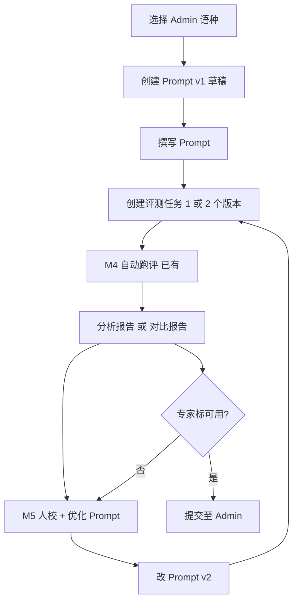

# PRD · AI 译评平台 · 一期增量

> 文档版本：v1.17 · 2026-06  
> 关联文档：《一期功能清单》《双平台功能列表-一期》《PRD-Admin管理平台-一期》  
> **交互原型**：`AI 译评平台 & Admin/eval-prototype/`（已与发布管理合并为 **AI 译评工作台**，见 §7.3）

---

## 0. 产品决策（已确认）

| # | 决策 | 结论 |
|---|------|------|
| 1 | 自动过线 / Gate | **一期不做**：系统只产出**分析报告 / 对比报告**；**可用 / 不可用** 由语种专家**人工标注** |
| 2 | Prompt 槽位 | **沿用当前算法模板定义**（见 §7.2.2），一期不增删槽位 |
| 3 | 登录 / 权限 | **一期不做**；译评、Admin 均内网/VPN 使用 |
| 4 | Prompt 撰写形态 | **结构化分块编辑（一期原型）**；`system` **平台内置、仅可查看**；专家撰写 `name_mapping` / `engineering`；**Markdown 分块入口为 P1** |
| 5 | 双译文评测称谓 | 产品/UI 使用 **平台翻译 / 人工校对**（见 §7.1.1）；**不再**全局固定「t0=AI、t1=人工」 |
| 6 | 提交 Admin 前置 | 仅专家标为 **可用** 的版本可「提交可应用」；报告 ID 必填；`gate_result` 可选入库字段（**不驱动**可用状态） |
| 7 | 访问方式 | **仅公司内网 VPN**；一期不做登录 |
| 8 | changelog | **可选**；有则便于版本对比，不阻断保存 |
| 9 | 语种规则版本状态（列表） | UI 称 **语种规则版本**；落库仍为 Prompt 版本；**待评测 / 评测中 / 可用 / 不可用 / 已提交** |
| 10 | 版本可用状态 | **待评测 / 评测中 / 可用 / 不可用 / 已提交**；**可用 / 不可用** 仅来自专家人工标注（见 E-2.3），**不**由报告或规则自动写入 |
| 11 | M3 知识块 / 语种规则 | **一期不体现**（无独立规则库 UI）；专名/工程约束等写入 Prompt 各槽；M3 结构化 **后续迭代** |
| 12 | 产品形态 | **一个工作台、三个模块（其中人校评阅一期仅占位）、两块后端**：本 PRD 能力归属 **规则评测** + **迭代服务**；**人校评阅**、**发布管理**见双平台 §1；统一 IA 见《双平台功能列表》§1 |
| 13 | 产品命名 | 工作台 **AI 译评工作台**；模块 **规则评测** / **人校评阅** / **发布管理**（`#/iter` / `#/review` / `#/config`） |
| 14 | 人校评阅模块 | **一期仅占位**（原型说明页），**不交付**结果详情/review 功能；规划承载逐条评阅 + 人工改分（见 E-5.x 后续） |

---

## 1. Summary

AI 译评平台已具备**评测任务、自动评测、人校反馈**能力。一期在现有基础上补齐 **Prompt 撰写与版本化、分析报告 / 对比报告、专家标注可用、提交 Admin** 等能力，使新语种能在平台内完成「写 Prompt → 跑评 → 看报告 → 人校 → 优化 → 专家标可用 → 提交 Admin」闭环，支撑约 **3.5 天**新语种 SOP。

---

## 2. Contacts

| 角色 | 姓名 | 职责 |
|------|------|------|
| 产品 | （待填） | 需求、验收、过线规则拍板 |
| 算法 / 平台 | 蒙则韶 | 评测 engine、Prompt 槽位与拼 Prompt 逻辑 |
| 语种专家 | （待填） | Prompt 撰写、人校 |
| 研发 | （待填） | 译评平台增量开发 |
| Admin 对接 | 张小飞、李姝宜 | 接收候选版本 API 联调 |

---

## 3. Background

### 3.1 背景

AI 译配业务按周产剧、多语种扩展。每个新语种需经历：写 Prompt → 对比评测 → PE 优化 → 测试/预发/正式上线。当前：

- **评测链路已上线**：M1 评测任务、M4 自动评测（system_v1：11 维、多裁判、批量跑评、汇总报告）、M5 人校工作台（筛选、对比原文/双译文、改分、导出 JSONL）。
- **缺口**：Prompt 仍靠飞书/本地 Markdown；过线靠人读报告；优化问题散落人校过程；过线版本无法结构化提交 Admin。

### 3.2 为什么现在做

1. 新语种 SOP 已收敛为 **4 阶段 / 约 3.5D**，阶段 2 明确要求「译评平台自动化」。
2. Admin 管理平台一期同步建设，译评必须产出**可入库、可关联报告**的 Prompt 版本。
3. 德语等语种已有 system_v1 评测框架，可复制到新语种，瓶颈在 **Prompt 迭代闭环**而非重跑评测。

### 3.3 一期边界

**规则评测模块（本 PRD）负责**：Prompt 迭代、评测、人校、分析/对比报告、专家标可用、提交入库。  
**不负责**：环境发布与 Config API（归 **发布管理模块 / 配置服务**）、登录权限、替代译配 PE 生产。  
**产品形态**：侧栏三模块 — **规则评测**（`#/iter`）、**人校评阅**（`#/review`，一期仅占位）、**发布管理**（`#/config`）；分路由分页面，非同一详情 Tab。后端仍为 **迭代服务** + **配置服务**（见《双平台功能列表》§1）。

---

## 4. Objective

### 4.1 目标

在**不重建** M1/M4/M5 的前提下，补齐 Prompt 与 Admin 对接能力，实现：

- 语种专家在平台内维护 Prompt 版本并绑定评测任务；
- 评测任务产出**分析报告**（单版本）或**对比报告**（双版本），供专家决策；
- 语种专家在版本列表**人工标注可用 / 不可用**；
- 人校问题可汇总为**优化清单**（P1），指导下一版 Prompt；
- **可用**版本**一键提交 Admin**，携带报告 ID（及可选 `gate_result` 快照）。

### 4.2 业务价值

| 对象 | 收益 |
|------|------|
| 语种专家 | 少在文档与平台间拷贝；优化有清单可依 |
| 算法 / PE | Prompt 版本与评测报告可追溯 |
| 业务 | 新语种 SOP 阶段 2 压缩到 **1 个工作日内**（试点剧 + 前 3 集） |
| 公司 | 与 Admin 配合实现 Prompt **零代码发版** |

### 4.3 关键结果（KR）

| KR | 指标 | 目标 |
|----|------|------|
| KR1 | 新语种 Prompt 从 v1 到过线提交 | ≤ 2 轮迭代（试点范围） |
| KR2 | 阶段 2（对比+人校+一轮优化） | ≤ 1 工作日 |
| KR3 | 提交 Admin 的版本 | 100% 携带评测报告 ID；且均为专家已标 **可用** |
| KR4 | 报告产出 | 单版本任务 100% 有分析报告；双版本任务 100% 有对比报告（试点范围） |

---

## 5. Market Segment(s)

### 5.1 主要用户

| 用户 | 场景 | 约束 |
|------|------|------|
| **语种专家** | 写 Prompt（三槽分块）、人校、根据清单改 Prompt | 习惯 Markdown；不一定懂 JSONL |
| **算法工程师** | 配置评测任务、看过线报告、对接 Prompt 槽位 | 需与 system_v1 规范一致 |
| **PE / 质检** | 人校、标记问题、导出材料 | 使用已有 M5 工作台 |

### 5.2 使用范围

- **语种**：一期以新语种接入为主（如德语已试点，复制到其他语对）。
- **评测范围**：SOP 约定——**指定试点剧 + 默认前 3 集**；不做全库自动化。
- **环境**：译评侧无「发布到正式」；仅「提交候选至 Admin」。

---

## 6. Value Proposition(s)

### 6.1 用户任务（JTBD）

> 当我要接入一个新语种时，我想在**同一个平台**里写完 Prompt、跑完评测、看完人校结论，并知道这版能不能交给 Admin 发布，这样我就不用反复贴文档、猜报告、找研发改代码。

### 6.2 价值

| 维度 | 现状痛点 | 一期后 |
|------|----------|--------|
| Prompt 管理 | 飞书/本地文件，版本混乱 | 平台内分块 + 版本号 + changelog |
| 质量门禁 | 人工读 11 维报告 | 平台出分析/对比报告 + 专家标可用 |
| 优化效率 | 问题散落聊天记录 | 优化清单按维度/剧汇总 |
| 发布衔接 | 口头/手工同步 Admin | 一键提交，报告 ID 绑定 |

### 6.3 差异化

相比「只做离线 JSONL + HTML 查看器」，译评平台一期形成**可发布版本**的输出，与 Admin 配置化发布闭环，而非仅作分析工具。

---

## 7. Solution

### 7.1 用户主流程

#### 7.1.1 双译文评测字段（产品 vs 数据层）

**产品/UI（对外）**：与现网 `system_v1.md` 可靠性报告一致，使用 **平台翻译**、**人工校对** 指代两版待比译文；汇总报告、人校工作台、译评报告**不**向业务用户展示 t0/t1 字母标签。

**数据层（JSONL / API 兼容）**：历史 `system_v1` 批处理与 `subtitle.html` 仍使用下列 **key 名**（实现字段，非产品定义）：

| 字段 key | 典型映射（本期 SOP 默认） | 说明 |
|----------|---------------------------|------|
| `st` | 原文 | 源语言台词 |
| `t0` | 平台翻译 | 待优化/待过线的一版 |
| `t1` | 人工校对 | 对照基线的一版 |
| `score0` | 平台翻译得分 | 0–100 |
| `score1` | 人工校对得分 | 0–100 |

> **已废止**：「全平台固定 t0=平台 AI、t1=人工 PE、且不可对调」——该约定仅适用于早期试点文档；新任务以**任务配置的两版译文角色**为准，key 名保留仅为兼容存量 JSONL。

**对比目的**：平台翻译相对人工校对在各维度是否达标（`score0` vs `score1`），支撑 Prompt 迭代；**是否可用由专家根据报告人工判定**。



### 7.2 模块与功能需求

#### 7.2.1 M1 · 评测任务（已有 · 增强）

| 需求 ID | 功能 | 描述 | 验收标准 | 优先级 |
|---------|------|------|----------|--------|
| E-1.1 | 关联 Admin 语种 | 创建/编辑评测任务时选择 Admin `language_id` | 任务详情展示语对 + Admin ID；无 ID 时提示先建 Admin 语种 | P0 |
| E-1.2 | 绑定规则版本 | 创建任务时选 **1～2 个**语种规则版本；「评测中」不可选 | 1 个 → **分析报告**；2 个 → **对比报告**；任务含 `eval_prompt_version_ids[]`、`report_kind` | P0 |
| E-1.3 | 任务状态与报告 | 维持现有能力 | 待跑/运行中/完成/失败；失败可重试；关联 JSONL + 报告 | 已有 |
| E-1.4 | 报告展示 | 任务完成后打开报告 | 单版本：各维 **平台 vs 人工** 指标；双版本：**版本间对比**（均分/胜率/维度胜负等），**不**展示系统「可用/不可用」结论 | P0 |

#### 7.2.2 M2 · Prompt 撰写（新建）

**产品决策**：一期专家在 **语种规则版本**（UI）内按三槽撰写；`system` 只读；**不**单独提供知识块库 UI；落库/API 仍为 `eval_prompt_version` + `blocks`。

##### 共用能力（P0）

| 需求 ID | 功能 | 描述 | 验收标准 |
|---------|------|------|----------|
| E-2.0 | 统一块模型 | 所有入口读写同一 `blocks` 结构 | 与 Admin / 评测 JSONL 一致 |
| E-2.2 | 版本号 | v1/v2/v3 或 semver；changelog **可选** | 版本列表倒序；已提交 Admin 的版本不可删 |
| E-2.3 | 版本状态 | **待评测 → 评测中 → 可用/不可用 → 已提交** | **可用 / 不可用** 由专家**人工切换**（需填写操作人姓名）；**不**由报告自动写入；**可用** 后可提交 Admin |
| E-2.6 | 人工标可用 | 版本行操作：**标为可用** / **标为不可用** / 取消标注 | 记录 `expert_usability`、`marked_by`、`marked_at`；已提交版本不可改 | P0 |
| E-2.4 | 关联评测 | 版本详情列出绑定任务 | 可跳转任务/报告（分析或对比） |
| E-2.5 | 版本 diff | 相邻版本块级对比 | P1 |

##### 方案 A · 结构化分槽编辑（P0 · 对齐 `eval-prototype`）

| 需求 ID | 功能 | 描述 | 验收标准 |
|---------|------|------|----------|
| E-2B.1 | 分块编辑 | 弹窗内按槽位切换；`system` 只读展示，另两槽可编辑保存 | `name_mapping` / `engineering` 可保存 |
| E-2B.2 | 新建草稿 | 可从上一版复制三槽作为起点 | 保存后关闭弹窗并刷新列表 |

##### 方案 B · Markdown 分块（P1）

| 需求 ID | 功能 | 描述 | 验收标准 |
|---------|------|------|----------|
| E-2A.1 | Markdown Tab | 按槽位上传/粘贴 `.md`，与结构化入口读写同一 `blocks` | 与 E-2B 数据一致 |
| E-2A.2 | 模板拆分视图 | 只读展示「专家填 / 系统拼」说明 | 与算法模板文档同步 |

**Prompt 槽位（当前算法模板定义 · 一期固定）**

> 与现网拼 Prompt 逻辑一致；**不得擅自增删 key**。

| 槽位 key | 中文名 | 说明 |
|----------|--------|------|
| `system` | 系统提示 | **平台内置，专家仅可查看**；角色、翻译原则、质量要求 |
| `name_mapping` | 人名映射 | 人名、称谓、专名、职位/公司名等映射规则 |
| `engineering` | 工程约束 | CPS、字符数、时长、合并拆分等工程规范 |

#### 7.2.3 M3 · 语种知识块（一期不交付）

> **一期范围外**：不在译评 UI 展示知识块/语种规则；相关内容由专家写入 Prompt 的 `name_mapping` / `engineering` 等槽。下列需求保留为 **v2.0 / 后续** 参考。

| 需求 ID | 功能 | 描述 | 优先级 |
|---------|------|------|--------|
| E-3.1 | 知识块录入 | 专名、称谓、俗语、禁忌、术语等条目化 | 后续 |
| E-3.2 | 关联 Prompt | 选定知识块参与版本拼装 | 后续 |
| E-3.3 | 专家备注 | 人校/报告维度备注 | P1（人校侧，不依赖 M3 UI） |
| E-3.4 | 知识块独立版本 | 与 Prompt 版本解耦 | 后续 |

#### 7.2.4 M4 · 自动评测（已有 · 增强）

| 需求 ID | 功能 | 描述 | 验收标准 | 优先级 |
|---------|------|------|----------|--------|
| E-4.1 | 评测 engine | 11 维 JSONL、多裁判、批量跑评、汇总报告 | 维持 system_v1 能力 | 已有 |
| E-4.2 | 读 M2 Prompt | 跑评时使用任务所选 Prompt 版本拼 prompt | 与手工拼 prompt 结果一致（抽样验证） | P0 |
| E-4.3 | 自动过线规则 | 可配置规则集自动判 pass/fail | **二期**；一期见 §7.2.5 |
| E-4.4 | 工程指标标注 | 输入侧 CPS/时长/字符违规行前置标记 | 工作台可按「仅违规」筛选 | P1 |

#### 7.2.5 报告类型与内容（一期）

| `report_kind` | 触发条件 | 报告内容（示例） |
|---------------|----------|------------------|
| `analysis` | 任务绑定 **1** 个规则版本 | 该版相对人工的 11 维均分、胜率、共识、维度明细、摘要 |
| `compare` | 任务绑定 **2** 个规则版本 | 在上述指标基础上增加 **版本间对比**（如 v2 vs v1 整体均分差、维度胜负数、结论摘要「v2 优于 / 劣于 / 持平 v1」） |

**一期不做**：根据报告或规则配置**自动**将版本标为可用/不可用。  
**专家动作**：阅读报告 + 人校后，在版本列表**人工**标可用/不可用。  
**提交 Admin**：仅 `expert_usability = usable` 且非已提交版本可提交；payload 可带 `eval_report_id`、可选 `gate_result`（若未来跑批仍产出，仅作存档）。

#### 7.2.5c AI 建议使用版本（后续 · 非一期）

任务报告生成后，系统可基于分析/对比报告给出 **AI 建议使用版本**（及简短理由），辅助专家决策：

| 能力 | 说明 |
|------|------|
| 展示位置 | 对比报告弹窗 / 任务完成摘要；版本列表对应行旁 **「AI 建议：vN」** 标签 |
| 单版本任务 | 建议「继续迭代」或「可进入专家复核」等文案（**不**等同标可用） |
| 双版本任务 | 建议采纳较优一方（如「建议采用 v2」），附维度胜负与置信说明 |
| 与专家标注 | **建议 ≠ 可用**；不自动写入 `expert_usability`；不阻断提交 |
| 可选增强 | 专家一键「采纳建议 → 标为可用」；采纳/忽略记入审计 |

数据字段（草案）：`ai_recommended_version_id`、`ai_recommendation_reason`、`ai_recommendation_at`。

#### 7.2.5b 自动过线规则（二期 · 原 E-4.3）

> 保留需求草案：按语种配置阈值规则，自动计算 `gate_result` 并可与专家标注对照。一期原型与 UI **不交付** 规则配置区。

#### 7.2.6 M5 · 人校反馈（已有 · 增强）

| 需求 ID | 功能 | 描述 | 验收标准 | 优先级 |
|---------|------|------|----------|--------|
| E-5.1 | 结果工作台 | 筛选、分页、原文/双译文、双分、reason、导出 JSONL | 维持现有能力 | 已有 |
| E-5.0 | 人校入口 | 迁入 **人校评阅** 模块（见 §0 #14）；规则评测仅保留分析/对比**报告摘要** | 一期原型：人校评阅为占位页；现网 M5 不回归 | 后续 |
| E-5.2 | 问题归档 | 对行/维度标记问题类型（专名/CPS/语义/…） | 支持批量标记；按剧/维度汇总 | P1 |
| E-5.3 | 优化清单 | 从归档生成清单：问题类型、例句、建议、关联 Prompt 槽位 | 支持导出 Markdown/CSV | P1 |
| E-5.4 | 改分留痕 | 改分/改 reason 时填写操作人 | 审计字段可查 | P1 |
| E-5.5 | 从清单建 Prompt 草稿 | 一键创建 vN+1 草稿并关联上一任务 | 草稿预填 changelog 模板 | P1 |

#### 7.2.7 M6 · Admin 对接（新建）

| 需求 ID | 功能 | 描述 | 验收标准 | 优先级 |
|---------|------|------|----------|--------|
| E-6.1 | 提交可应用 | POST Admin；携带语种 ID、版本号、各块内容、报告 ID；`gate_result` 可选 | 前置：**专家已标可用**；**自动入库**；失败可重试 | P0 |
| E-6.2 | 读 Admin 生效版本 | GET 测试环境当前 Prompt version ID | 可发起「复验评测」任务 | P1 |
| E-6.3 | 导出 | JSONL、汇总报告、优化清单下载 | 与现有导出并存 | P1 |

**译评 → Admin 提交 payload（一期）**

```json
{
  "admin_language_id": "lang_de_zh",
  "eval_prompt_version_id": "eval-pv-012",
  "version_label": "v3",
  "changelog": "优化专名映射",
  "blocks": {
    "system": "...",
    "name_mapping": "...",
    "engineering": "..."
  },
  "eval_task_id": "task-456",
  "eval_report_id": "report-456",
  "expert_usability": "usable",
  "gate_result": null
}
```

### 7.3 页面清单（一期）

**原型目录**：`AI 译评平台 & Admin/eval-prototype/`（`prototype/` 跳转）— **侧栏双模块**、列表 + **分模块详情页**（无 Tab）。

| 页面 | 路由 / 说明 | 原型 |
|------|-------------|------|
| 语种管理（规则评测） | `#/iter` · **+ 新建语种**；列：语种、语对、**最新规则版本**、负责人；`← 语种管理` 返回列表 | ✅ |
| 语种管理（发布管理） | `#/config` · **+ 新建语种**；列：语种、语对、**应用阶段**、已入库数、负责人 | ✅ |
| 规则评测详情 | `#/iter/lang/{id}` · 语种规则版本（**人工标可用**）/ 评测任务（**分析报告 / 对比报告**） | ✅ |
| 发布管理详情 | `#/config/lang/{id}` · 环境摘要 / 环境发布 / 已入库 Prompt / 发布历史（折叠） | ✅ |
| 规则版本编辑 | 三槽弹窗；**保存**后关闭；关闭/遮罩可丢弃未保存修改 | ✅ |
| 创建评测任务 | 规则版本 **1～2**、试点剧、集数 | ✅ |
| 分析报告 / 对比报告 | 弹窗 · 维度与对比摘要；**无**系统可用结论 | ✅ |
| 提交可应用 | 弹窗 · 自动入库并跳转配置详情 | ✅ |
| 界面 | **不展示** Admin 技术 ID | ✅ |
| 人校评阅 | `#/review` · **仅占位**（说明页，无结果详情/review 功能） | ✅ 占位 |
| Markdown 撰写 Tab | 与结构化双入口 | — P1 |
| 优化清单 / 批量导出 | E-5.3 / E-6.3 | — P1 |
| AI 建议使用版本 | 报告/列表展示建议版本与理由 | — 后续 |

### 7.4 Technology

- 评测 engine：延续 system_v1 JSONL 规范与现有多裁判调度。
- Prompt 存储：结构化块 + 版本表；候选快照不可变。
- 与 Admin：REST JSON；内网调用；失败重试 + 幂等（`eval_prompt_version_id` 去重）。

### 7.5 Assumptions

| 假设 | 风险 | 验证方式 |
|------|------|----------|
| M1/M4/M5 线上能力与文档一致 | 联调时发现缺口 | 一期启动前走查现网 |
| Prompt 槽位与算法模板一致 | 拼 prompt 不一致 | 固定三槽位；变更需算法侧发版 |
| 专家未标可用即提交 | 误发布 | 提交按钮仅对 **可用** 版本启用；二次确认 |
| 仅 VPN 访问 | 外网误暴露 | Admin/译评仅内网域名，不对公网开放 |
| Admin API 同期可用 | 提交阻塞 | 与 Admin PRD 联调里程碑对齐 |
| 一期无登录可接受 | 误操作 | 关键操作二次确认 + 操作人文本字段 |

### 7.6 Out of Scope（一期不做）

- **M3 知识块 / 语种规则**独立 UI（专名等写入 Prompt 槽即可）  
- **登录、RBAC、审批流**（已确认一期不做）  
- 在译评内发布到测试/预发/正式  
- 替代译配编辑器做 PE  
- 全库自动化评测  
- 新增 Prompt 槽位（超出 system / name_mapping / engineering）  
- **AI 建议使用版本**（见 §7.2.5c；一期仅专家人工标可用）

---

## 8. Release

### 8.1 版本划分

| 版本 | 包含 |
|------|------|
| **v1.0（P0）** | M2 结构化撰写；M1/M4；M6；M5 入口（现网+占位） |
| **v1.1（P1）** | Markdown 入口、M5 归档/清单、导出、diff、复验、留痕 |
| **v2.0** | **AI 建议使用版本**、自动过线规则 + 与专家标注对照、知识块高级版本、登录权限 |

### 8.2 验收（P0）

1. 选定 1 个语种，完成 Prompt v1 → 跑评 → 看分析/对比报告 → 现网人校 → v2 → **专家标可用** → 提交 Admin 全链路。  
2. 提交 payload 在 Admin 版本库可见，且 `eval_report_id` 正确；仅专家标 **可用** 的版本可提交。  
3. 阶段 2 SOP 在试点范围 **1 个工作日内**跑通（业务侧签字）。  
4. M1/M4/M5 已有功能无回归。

### 8.3 待拍板项

- [ ] 译评 ↔ Admin 联调里程碑日期  
- [x] Admin **不校验 Gate**；仅 **pass / pass_with_warnings** 可提交 Admin（见 Admin PRD §0 #1）

---

### 文档修订记录

| 版本 | 日期 | 变更摘要 |
|------|------|----------|
| v1.2 | 2026-06 | t0/t1、双入口 P0、过线 UI 配置 |
| v1.3 | 2026-06 | 新增 eval-prototype；E-6.1 自动入库；§7.3 对齐原型 |
| v1.4 | 2026-06 | changelog 可选；取消候选态；「是否可用」列；过线规则 UI 暂缓 |
| v1.5 | 2026-06 | Prompt 状态四态+已提交；合并「是否可用」列 |
| v1.6 | 2026-06 | 内置 System + 语种规则主编辑（已撤回） |
| v1.7 | 2026-06 | **一期不体现** M3/语种规则库；恢复 Prompt 三槽直接编辑 |
| v1.8 | 2026-06 | UI **语种规则版本**；`system` 只读；编辑弹窗槽位区等高 |
| v1.9 | 2026-06 | 恢复语种详情 **可用规则** 配置区（讨论用原型） |
| v1.10 | 2026-06 | 工作台侧栏双应用；语种管理列表；详情 `← 语种管理` |
| v1.11 | 2026-06 | 对齐 `eval-prototype`：结构化撰写 P0、Markdown/归档/导出 P1；M5 入口占位 P0 |
| v1.12 | 2026-06 | **废止**全局固定 t0/t1 产品定义；UI 统一 **平台翻译/人工校对**；JSONL key 仅作数据层兼容说明 |
| v1.13 | 2026-06 | 删除 §8 里程碑；E-5.0 人校入口并入评测任务表 |
| v1.14 | 2026-06 | **一期**：仅分析/对比报告；**可用由专家人工标注**；自动过线规则移至二期 |
| v1.15 | 2026-06 | 新增 §7.2.5c **AI 建议使用版本**（后续，不替代专家标可用） |
| v1.16 | 2026-06 | 产品命名：**AI 译评工作台** / **规则评测** / **发布管理** |
| v1.17 | 2026-06 | 新增模块 **人校评阅**（`#/review`）· 一期仅 IA 占位，不交付功能 |

*PRD v1.17 · 译配更新见 Admin PRD §7.2.4*
