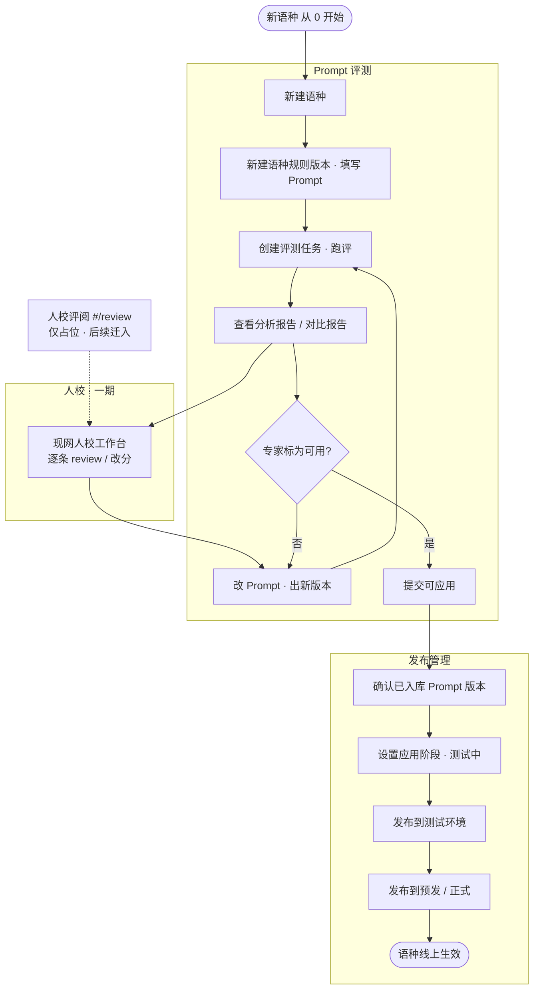

# AI 译评工作台 · 一期功能清单

> **v1.13 · 2026-06** — 简版，供评审和对齐用。  
> 详版：《平台功能列表-一期》v0.12、《PRD-Prompt 评测-一期》v1.21、《PRD-发布管理模块-一期》v1.18。  
> **工作台原型（合并）**：`AI 译评工作台/eval-prototype/`（`prototype/` 自动跳转）

**目标**：新语种按 SOP（约 3.5 天）跑通——在译评平台写 Prompt、跑评测、看报告并由专家标可用后，经发布管理发布到测试/预发/正式，译配运行时自动读配置，**不再改代码发版**。

---

## 0. 已确认决策（汇总）

| 项 | 结论 |
|----|------|
| 可用判定 | **一期人工**：专家标可用/不可用；系统只出**分析/对比报告** |
| 自动过线 | **二期**；一期不做规则配置 UI |
| AI 建议版本 | **后续**：报告/列表展示「建议采用 vN」；**不**自动标可用 |
| Prompt 槽位 | `system` / `name_mapping` / `engineering` |
| Prompt 撰写 | **结构化分槽 P0**（原型）；Markdown 入口 **P1** |
| 登录 | **一期不做** |
| 访问 | **仅公司内网 VPN** |
| Gate | **仅 Prompt 评测专家标「可用」可提交**；**发布管理不展示** gate |
| 发布管理 Web | 见《PRD-发布管理模块-一期》**§7.2.6** + `eval-prototype/` |
| 双译文称谓 | 产品/UI：**平台翻译 / 人工校对**；JSONL 字段 `t0`/`t1` 仅为数据层兼容（见《PRD-Prompt 评测-一期》§7.1.1） |
| 译配更新配置 | **消息（主）+ 轮询（兜底）** + 本地缓存 etag |
| **产品形态** | **一个工作台、三模块（人校评阅占位）、两块后端**（详见《平台功能列表-一期》§1） |
| **产品命名** | 工作台 **AI 译评工作台**；模块 **Prompt 评测** · **人校评阅** · **发布管理**（`#/iter` · `#/review` · `#/config`） |
| **人校评阅** | **一期仅占位**，不新增功能交付 |
| **新建语种** | **仅 Prompt 评测**；创建后 **自动同步** 发布管理列表（发布管理 **无** 新建按钮） |

### 双译文评测（平台翻译 vs 人工校对）

评测时每一句字幕包含：**原文** + **平台翻译** + **人工校对** 两版译文；裁判分别打分（数据层为 `score0` / `score1`），比较平台版能否打平或超过人工底稿。  
**不再**使用「t0/t1」作为面向业务的产品称谓（与 `system_v1.md` 汇总报告一致）。

---

## 1. AI 译评工作台（一个入口 · 三模块）

| 模块 | 干什么 | 不干什么 | 后端 |
|------|--------|----------|------|
| **Prompt 评测**（原译评） | 写语种规则、跑评测、分析/对比报告、专家标可用、提交入库 | 逐条结果评阅、多环境发布 | **迭代服务** |
| **人校评阅**（规划） | 评测结果详情、人工 review | **一期不交付**（仅占位） | 迭代服务（后续） |
| **发布管理** | 语种壳、版本库、测试/预发/正式发布与回滚 | 写 Prompt、跑评测 | **配置服务** |

**主链路**：迭代（写 + 评 + 可用）→ 配置（入库 + 发环境 + 通知）→ 译配（缓存读配置）  
**一期工程**：前端可先合并 **工作台壳** + 同语种详情路由；API 仍两套，经 BFF 或直连聚合。

---

## 2. 运营主流程（新语种 0 → 发布）

> 运营视角：只体现**模块与操作**，不含后端服务。语种仅在 **Prompt 评测** 创建，**发布管理** 自动同步、无「新建语种」。

| 顺序 | 操作 | 模块 |
|------|------|------|
| 1 | 新建语种 → 写规则版本 → 跑评 → 看报告 | Prompt 评测 |
| 2 | 人校 → 改 Prompt 再评（可多轮）→ 标可用 | Prompt 评测 + 现网人校 |
| 3 | 提交可应用 | Prompt 评测 |
| 4 | 确认版本 → 测 / 预发 / 正式发布 | 发布管理 |

---

## 3. 译评平台

### 已有（本期不重做）

- **评测任务**、**自动评测**（11 维 JSONL、多裁判、批量跑评、报告）  
- **人校反馈**（筛选、原文/双译文对比、改分、导出 JSONL）

### 一期要做

| 功能 | 说明 | 优先级 |
|------|------|--------|
| **Prompt 撰写** | 结构化分槽弹窗；三槽位；版本 + changelog | P0 |
| **Markdown 撰写** | 与结构化双入口 | P1 |
| **知识块 / 语种规则** | 条目化规则库 | **一期不做**（内容写入 Prompt 槽） |
| **分析/对比报告** | 单版本分析、双版本对比；**不**自动标可用 | P0 |
| **专家标可用** | 人工标可用/不可用后可提交可应用 | P0 |
| **人校评阅模块** | 侧栏占位 `#/review` | **仅占位** |
| **问题归档 → 优化清单** | | P1 |
| **提交可应用** | 自动入库至发布管理 | P0 |
| **导出** | JSONL / 报告 / 清单 | P1 |
| 任务关联 `language_id` | P0 |

---

## 4. 发布管理（全新）

| 功能 | 说明 | 优先级 |
|------|------|--------|
| 语种管理 + 详情（**VPN**） | `#/config` · 列表：**语种**、语对、**应用阶段**、已入库、负责人；详情：环境摘要 + 发布 + **Prompt 版本** + 历史 | P0 |
| 新建语种 | **仅 Prompt 评测**；同步配置服务；发布管理只读列表 | P0 |
| 应用阶段流转 | 手动改 `status` | P1 |
| 译评提交可应用 | **自动入库**，Prompt 版本立即可见；无确认入库 | P0 |
| 测试 / 预发 / 正式发布、回滚 | 表列：版本、生效时间、操作人；环境仅中文展示 | P0 |
| Prompt 版本 | 分槽位查看；**评测报告**跳转译评；无 Gate 列 | P0 |
| 配置 API（含 etag / 304） | P0 |
| **发布/回滚 → 消息通知译配** | P0 |

---

## 5. 译配（对接）

发布管理 发布后，译配拿新 Prompt 的方式（**两种都要做**）：

| 方式 | 角色 | 说明 |
|------|------|------|
| **消息通知** | 主路径 | 发布管理 发布/回滚 → 发消息 → 译配清缓存 → 立刻拉新配置（目标 ≤10s） |
| **轮询** | 兜底 | 每 5–15min 带 etag 向发布管理查询；没变返回 304，变了就拉新配置 |
| **本地缓存** | 基础 | 按语种+环境缓存；所有请求都带 etag，减少重复拉取 |

详版见《PRD-发布管理模块-一期》§7.2.4。

---

## 6. 验收标准

1. 新语种 Prompt 上测试环境：**零代码发版**  
2. 每版上线 Prompt：**≥1 份评测报告**；译评侧**专家标可用**  
3. 阶段 2 对比 + 一轮优化：**≤1 工作日**（试点范围）  
4. 发布管理 发布后译配：**消息路径 ≤10s** 或轮询周期内生效  

---

*v1.13 · 2026-06 · 全文「Admin」改为「发布管理」；§2 运营主流程*
