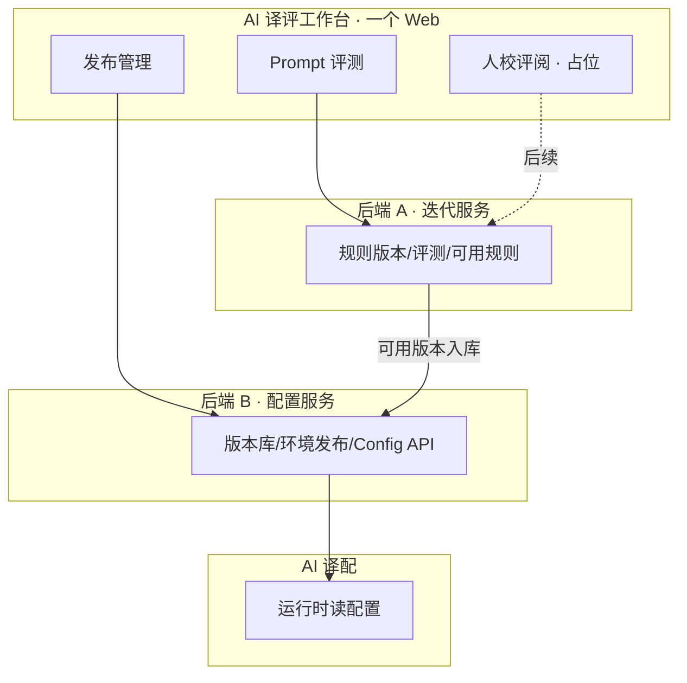

# AI 译评工作台 · 平台一期功能列表

> **文档版本**：v0.12 · 2026-06  
> 基于新语种落地 SOP（整体约 3.5D；**发布管理侧映射为 3 个阶段**，预发/正式不单列阶段 4）及 2026-06 讨论结论整理。  
> **范围**：AI 译评工作台（Prompt 评测 + 发布管理模块）；不含 AI 译配生产平台本期改造明细（仅列对接项）。  
> **详版 PRD**：《PRD-Prompt 评测-一期》v1.15、《PRD-发布管理模块-一期》v1.12、《一期功能清单》v1.7  
> **工作台原型**：`AI 译评工作台/eval-prototype/`（`prototype/` 跳转）

---

## 〇、已确认决策（与 PRD 对齐）

| 项 | 结论 |
|----|------|
| 可用判定 | **一期人工**：专家标可用；系统出**分析/对比报告**；自动过线 **二期** |
| 提交可应用 | 仅译评**专家标可用**可提交；发布管理 **不展示 Gate** |
| Prompt 槽位 | `system` / `name_mapping` / `engineering`（一期不增删） |
| Prompt 撰写 | **结构化分槽 P0**（`eval-prototype`）；**Markdown 入口 P1**；共用同一 `blocks` |
| 双译文称谓 | 产品/UI：**平台翻译 / 人工校对**；JSONL `t0`/`t1` 仅数据层 key（见《PRD-Prompt 评测-一期》 §7.1.1） |
| 登录 | **一期不做**；仅 VPN 内网 |
| 译配拿配置 | **消息（主，≤10s）+ 轮询（兜底，5–15min）+ etag/304**（发布管理 §7.2.4） |
| **产品形态** | **一个工作台、两个模块、两块后端**（见 §一） |
| **产品命名** | **AI 译评工作台** · 模块 **Prompt 评测** / **人校评阅** / **发布管理** |
| **人校评阅** | **一期仅占位**（`#/review`）；不新增一期功能项 |

---

## 一、产品架构（已拍板 · 一个工作台）

### 1.1 总览

| 层 | 形态 | 说明 |
|----|------|------|
| **产品** | **AI 译评工作台**（统一 Web 入口） | 用户只面对「一个语种、一条生命周期」 |
| **模块一** | **Prompt 评测**（原译评能力） | 语种规则版本、评测任务、分析/对比报告、专家标可用 |
| **模块二** | **人校评阅**（规划） | 评测结果**详情** + 人工 review；**一期仅占位，不交付功能** |
| **模块三** | **发布管理** | 已入库版本、测试/预发/正式绑定、发布/回滚、变更历史 |
| **后端 A** | **迭代服务**（eval） | 撰写、评测、报告、gate、人校对接；可独立扩缩 |
| **后端 B** | **配置服务**（config） | 版本库 SSOT、环境发布、**译配 Config API**；高可用、轻量 |

**原则**：体验合一、职责分离；**生产配置不被评测负载拖垮**。

### 1.2 统一语种详情（目标信息架构）

**侧栏三模块**（一级入口，非同一页 Tab）：`#/iter` Prompt 评测 · `#/review` 人校评阅（占位）· `#/config` 发布管理；语种详情页为 `#/iter/lang/{id}`、`#/config/lang/{id}`。区块：

| 区块 | 所属模块 | 一期原型 |
|------|----------|----------|
| 列表 · Prompt 应用阶段 | 共用 | `eval-prototype/` |
| **语种规则版本** + 新建/编辑 | 迭代 | 同上 · 详情「Prompt 评测」 |
| **评测任务** + 报告 | 迭代 | 同上 |
| 应用阶段 + 环境摘要 + **环境发布** / 已入库版本 / 发布历史（可折叠） | 发布管理 | 配置详情 |
| **结果详情 / 人工 review** | 人校评阅 | **占位**（`#/review`） |

「提交可应用」在产品上变为：**可用 → 写入配置服务版本库**（模块间 API，用户无「跳 发布管理」体感）。

### 1.3 版本状态机（跨模块）

```
撰写/草稿 → 待评测 → 评测中 → 可用/不可用
  → 已入库（配置服务 SSOT）
  → 已绑定环境（test / staging / prod）
```

- **可用/不可用**：语种专家**人工标注**（`expert_usability`）；报告**不**自动改状态。
- **已入库**：仅译评标为 **可用** 的版本可提交配置服务；发布管理 **不二次展示 gate**（§0 #1 维持）。

### 1.4 模块间接口（两块后端）

| 调用方 | 被调方 | 能力 |
|--------|--------|------|
| 工作台 BFF / 迭代服务 | 配置服务 | `POST` 入库（原 M6 提交可应用）、查版本列表 |
| 配置服务 | 迭代服务 | 可选：拉评测报告链接、元数据 |
| 译配运行时 | 配置服务 | 按环境读生效 Prompt（消息 + 轮询 + etag） |

### 1.5 一期交付节奏（工程可分期）

| 阶段 | 用户可见 | 工程 |
|------|----------|------|
| **当前** | **侧栏三模块 HTML 原型**（`#/iter` / `#/review` 占位 / `#/config`） | `eval-prototype/` |
| **一期目标** | 对接真实 BFF + 双后端 API | 前端可沿用侧栏 + 分路由 |
| **二期** | 可选 BFF 单页聚合详情 | 可选统一登录/RBAC |



---

## 二、模块与历史命名对照

> 文档与代码库仍可能使用「译评平台 / 发布管理」；产品对外为 **AI 译评工作台** 下三模块（人校评阅一期仅占位）。

| 历史名称 | 工作台模块 | 后端 |
|----------|------------|------|
| AI 译评平台 | Prompt 评测 | 迭代服务 |
| M5 人校工作台 | 人校评阅（规划迁入） | 迭代服务（同期） |
| 历史工程名 admin | 发布管理 | 配置服务 |

**协作关系（不变）**：迭代产出 **可用** 的语种规则版本 → 配置服务入库 → 环境发布 → 译配拉取。

---

## 三、Prompt 评测模块 · 一期功能列表

### 3.0 现状盘点（2026-06 校正）

> **已有模块**：**M1 评测任务**、**M4 自动评测**、**M5 人校反馈** 已在译评平台上线，一期 PRD **不以重建为主**，仅列 **增强项** 与 **待对接项**。  
> **待建设模块**：**M2 Prompt 撰写**、**M3 语种知识块**、**M6 发布管理 对接** 为一期增量重点。

| 模块 | 现状 | 一期重点 |
|------|------|----------|
| **M1 评测任务** | ✅ 已有 | 发布管理 语种 ID 关联、与 Prompt 版本绑定增强 |
| **M2 Prompt 撰写** | ❌ 无 | **P0 新建**（方案 A 或 B） |
| **M3 语种知识块** | ⚠️ 部分（散落文档/人工维护） | 条目化入库，与 M2 联动 |
| **M4 自动评测** | ✅ 已有（system_v1 体系） | 过线规则可配置、工程指标标注增强 |
| **M5 人校反馈** | ✅ 已有（结果工作台） | 问题归档 → 优化清单；可选改分留痕 |
| **M6 发布管理 对接** | ❌ 无 | **P0 新建**（提交候选 + 导出） |

**已有能力基线（v1）**：11 维 JSONL 批评、多裁判（1～N）、批量跑评、汇总报告（均分/胜率/共识）、结果工作台（筛选/对比/改分/导出 JSONL）。参考：`【Eval】翻译效果评估/system_v1.*`、线上译评平台 M1/M4/M5。

### 3.1 目标

支撑 SOP **阶段 1（0.5D）+ 阶段 2（1D）+ 阶段 3 效果复验（部分）**：在单一平台完成 **撰写 → 评测 → 人工校验 → 反馈 → Prompt 优化** 闭环；输出可发布候选版本及评测报告。

**相对现状的缺口**：Prompt 在平台内撰写与版本化（M2）、知识块结构化（M3）、过线结论自动化（M4 增强）、候选版本提交可应用（M6）。

### 3.2 功能模块

#### M1 · 语种与评测任务 · ✅ 已有

| 编号 | 功能 | 说明 | 现状 | 一期 |
|------|------|------|------|------|
| E-1.1 | 新建语种并同步 | Prompt 评测「新建语种」→ 同步配置服务（同一 `language_id`）；发布管理列表自动可见 | — 新建 | **P0** |
| E-1.1b | 语种/语对档案 | 评测任务关联已注册 `language_id`、负责人 | 已有（语对/任务） | **增强** | P0 |
| E-1.2 | 评测任务创建 | 选择语种、Prompt 版本、试点剧/集范围（默认前 3 集）、双译文对比（平台翻译 vs 人工校对） | ✅ 已有 | 维持；与 M2 版本库打通 |
| E-1.3 | 任务状态 | 待跑 / 运行中 / 已完成 / 失败；失败可重试 | ✅ 已有 | 维持 |
| E-1.4 | 任务与报告关联 | 一次任务对应一份 JSONL + 汇总报告（胜率/均分/共识） | ✅ 已有 | 维持；报告可链到过线结论 |

#### M2 · Prompt 撰写 · ❌ 待建设（结构化 P0 · 原型已覆盖）

**产品决策**：一期原型为 **结构化分槽弹窗**（`eval-prototype`）；Markdown 分块入口 **P1**；读写同一 `blocks`。

| 编号 | 功能 | 说明 | 优先级 |
|------|------|------|--------|
| E-2.0 | 统一块模型 | 三槽位 `system` / `name_mapping` / `engineering` | P0 |
| E-2B.1 | 结构化分槽编辑 | 弹窗按槽编辑；`system` 只读 | P0 |
| E-2A.1 | Markdown 分块 | 按槽位上传/粘贴 `.md` | P1 |
| E-2.2 | 版本号 + changelog | v1/v2…；已提交可应用 的版本不可删 | P0 |
| E-2.3 | 草稿 / 候选 | 仅候选可提交可应用 | P0 |
| E-2.4 | 关联评测 | 版本详情链到任务与过线结论 | P0 |
| E-2.5 | 版本 diff | 块级对比 | P1 |

> 知识块条目化见 **M3**；不单独占 Prompt 槽位。

#### M3 · 语种专家 · 知识块（与 M2 联动）· ⚠️ 部分有、待结构化

| 编号 | 功能 | 说明 | 优先级 |
|------|------|------|--------|
| E-3.1 | 知识块录入 | 分类：专名规则、称谓、俗语/文化梗、禁忌、行业术语等 | P0 |
| E-3.2 | 知识块版本 | 随 Prompt 版本或独立版本号；评测报告可引用 | P1 |
| E-3.3 | 专家备注 | 对评测 reason / 典型句追加「专家结论」（采纳/不采纳） | P0 |

#### M4 · 自动化评测 · ✅ 已有（system_v1）

| 编号 | 功能 | 说明 | 现状 | 一期 |
|------|------|------|------|------|
| E-4.1 | 评估规范 engine | 11 维 JSONL 输出；德语 CPS/时长/字符硬约束写入规范 | ✅ 已有 | 维持；新语种规范可配置 |
| E-4.2 | 多裁判 | 支持配置 1～N 个 judge 模型；分裁判查看 | ✅ 已有 | 维持 |
| E-4.3 | 批量跑评 | 按任务自动拉字幕、拼 Prompt、调模型、落 JSONL | ✅ 已有 | 维持；读 M2 Prompt 版本 |
| E-4.4 | 🚨 工程指标 | 输入侧 CPS/时长违规标注；CPS 维可引用 | ⚠️ 部分 | **增强**：违规行前置标注 |
| E-4.5 | 汇总报告 | 均分、胜率、共识度（≥k 裁判同向）；导出 Markdown/表格 | ✅ 已有 | 维持 |
| E-4.6 | 过线规则（可配置） | **无预置默认阈值**；按语种 UI 填规则；未配则 `pending`；输出 pass/fail/warn | ❌ 无 | **P0 新建** |

#### M5 · 人工校验与反馈 · ✅ 已有

| 编号 | 功能 | 说明 | 现状 | 一期 |
|------|------|------|------|------|
| E-5.1 | 结果工作台 | 筛选、分页、原文/双译文、双分、reason；加载/导出 JSONL | ✅ 已有 | 维持；与 M2/M4 任务链打通 |
| E-5.2 | 在线改分/改 reason | 专家修正裁判结论；留痕（谁、何时）— 无登录时可先「操作人姓名」 | ⚠️ 部分（可改分） | **P1 增强**：操作人留痕 |
| E-5.0 | 人校评阅模块 | 独立模块 **人校评阅**（`#/review`）；一期仅占位，功能后续 | — 占位 | **后续** |
| E-5.3 | 问题归档 | 按维度/剧/行标记问题类型；汇总为「优化清单」 | ⚠️ 部分 | **P1 增强**：结构化归档 + 清单导出 |
| E-5.4 | 反馈 → 下一版 Prompt | 从归档一键创建「Prompt vN+1 草稿」并关联上一任务 | ❌ 无 | **P1**（依赖 M2） |

#### M6 · 与 发布管理 / 译配对接 · ❌ 待建设

| 编号 | 功能 | 说明 | 优先级 |
|------|------|------|--------|
| E-6.1 | 提交候选版本 | 过线 Prompt 版本「提交至 发布管理」；携带评测报告 ID、过线结论 | P0 |
| E-6.2 | 读 发布管理 生效版本 | 阶段 3 复验：读取测试环境当前 Prompt 版本 ID，发起对比评测 | P1 |
| E-6.3 | 导出 | JSONL / 报告下载；供周会、飞书归档 | P1 |

### 3.3 Prompt 评测 · 一期不做

- 用户登录、RBAC、审批流  
- 语种在正式/预发环境的 **发布按钮**（归 发布管理）  
- 替代译配编辑器做 PE 生产  
- 替代 CPS 规则引擎做批量修字幕  
- 全库自动化（仅支持 SOP 定义的试点范围，如前 3 集 + 指定试点剧）

### 3.4 与 SOP 映射

| SOP 阶段 | 译评平台承担 | 相对现状 |
|----------|--------------|----------|
| 1 提示词 0.5D | M2 Prompt 撰写 + M3 知识块 | **新建** |
| 2 对比测试 1D | M4 跑评 + M5 校验 + M2 优化闭环 | M4/M5 **已有**；补过线规则 + 归档 + M2 |
| 3 测试接入 1D | M6 对测试环境生效版本做复验评测 | **新建** 发布管理 读配置 + 复验任务 |
| 4 预发&正式 | 可选抽检评测；**发布不在本平台** | 同 M6 |

### 3.5 人校评阅模块（规划 · 一期仅占位）

| 项 | 说明 |
|----|------|
| 定位 | 评测**结果详情** + **人工 review**（逐条/逐维、改分、标记、导出） |
| 与Prompt 评测 | Prompt 评测提供**分析/对比报告（摘要）**；细阅在本模块 |
| 一期 | 原型 `#/review` 说明页；**不新增**功能清单与 P0 交付项 |
| 后续 | 可迁入现网 M5 人校工作台能力 |

---

## 四、发布管理模块 · 一期功能列表

### 4.1 目标

**解耦 Prompt 与代码工程**：语种接入/上线不再依赖研发改代码发版；本期 **不做登录**，面向内部可信环境使用。

### 4.2 功能模块

#### M1 · 语种管理

| 编号 | 功能 | 说明 | 优先级 |
|------|------|------|--------|
| A-1.1 | 语种列表 | **语种**（拼接）、语对、**Prompt 应用阶段**、负责人、详情；无三环境/正式版列 | P0 |
| A-1.2 | 语种注册（同步） | **无**发布管理 Web 新建；由 **Prompt 评测** 创建时 `POST /v1/languages`；`lang_{target}_{source}` | P0 |
| A-1.3 | 状态流转 | 手动切换状态（本期无审批）；禁止跳过测试直接上正式（可配置开关）；原型未含 UI | P1 |
| A-1.4 | 关联译评 | 展示该语种最近评测任务、过线结论、候选 Prompt 版本 | P1 |

#### M2 · Prompt 版本库

| 编号 | 功能 | 说明 | 优先级 |
|------|------|------|--------|
| A-2.1 | Prompt 版本列表 | 短版本名 v1/v2、来源、入库时间；评测报告链接 | P0 |
| A-2.2 | 版本查看 | 三槽位只读；不做 Markdown 主视图 | P0 |
| A-2.3 | 译评自动入库 | `POST submit` 成功即入 Prompt 版本列表；无待接收/确认 | P0 |
| A-2.4 | 手工录入（兜底） | 无译评时可直接粘贴 Markdown 块创建版本（应急） | P1 |
| A-2.5 | 版本对比 | 任意两版本 diff | P2 |

#### M3 · 环境与应用发布

| 编号 | 功能 | 说明 | 优先级 |
|------|------|------|--------|
| A-3.1 | 环境定义 | 固定三环境：**测试 / 预发 / 正式**（可扩展） | P0 |
| A-3.2 | 环境绑定 Prompt | 每个语种 × 环境 → 当前生效 Prompt 版本 ID | P0 |
| A-3.3 | 发布操作 | 将指定版本「应用到测试/预发/正式」；记录发布时间、操作人（文本） | P0 |
| A-3.4 | 回滚 | 将某环境切回上一生效版本 | P0 |
| A-3.5 | 发布历史 | 谁在何时把哪版本发到哪环境 | P0 |
| A-3.6 | 发布前 Gate 校验 | **一期不做**（译评提交前保证） | P2 |

#### M4 · 运行时配置 API & 译配更新（译配消费）

| 编号 | 功能 | 说明 | 优先级 |
|------|------|------|--------|
| A-4.1 | 拉 Prompt | `GET /v1/config/prompt` 返回 blocks + etag | P0 |
| A-4.2 | 语种可用性 | offline / `status=none` 返回不可用 | P0 |
| A-4.3 | etag / 304 | `If-None-Match`；未变返回 304 | P0 |
| A-4.4 | **发布/回滚发消息** | MQ 通知译配清缓存（主路径，目标 ≤10s） | P0 |
| A-4.5 | 健康检查 | `GET /health` | P0 |

**译配侧（@张雨时 @张健）**：订阅消息 + 定时轮询（5–15min 兜底）+ 本地缓存；详见 《PRD-发布管理模块-一期》 §7.2.4。

#### M5 · 管理端 UI（本期最小）

| 编号 | 功能 | 说明 | 优先级 |
|------|------|------|--------|
| A-5.1 | 管理 Web | 列表 + **详情单页**（概览/发布/Prompt 版本/历史）；**无登录**（VPN）；见 PRD §7.2.6 | P0 |
| A-5.2 | 操作人 | 发布/回滚时**必填**姓名或工号 | P0 |

### 4.3 配置模块 · 一期不做

- 登录、SSO、RBAC、审批流  
- 译配编辑器、字幕 PE、配音能力  
- 自动化评测（归译评平台）  
- 复杂 workflow（多步审批、定时发布）  
- 与财务/结算、供应商合同联动  

### 4.4 与 SOP 映射

| SOP 阶段 | 发布管理 承担 |
|----------|------------|
| 1 提示词 0.5D | **Prompt 评测** 新建语种并同步配置壳（`status=none`）；正文在 Prompt 评测 |
| 2 对比测试 1D | 译评提交可应用 → 发布管理 Prompt 版本自动可见 |
| 3 测试接入 1D | **测试环境发布**；通过后 **预发/正式发布 + 回滚**（《PRD-发布管理模块-一期》 不单列阶段 4） |

---

## 五、模块间接口（一期最小契约）

| 方向 | 接口/动作 | 数据 |
|------|-----------|------|
| 译评 → 发布管理 | 提交候选 Prompt 版本 | 语种 ID、版本号、各块内容、评测报告 ID、过线结论 |
| 发布管理 → 译评 | 查询环境生效版本 | 语种 ID、环境、当前 version ID |
| 发布管理 → 译配 | 运行时拉配置 | 语种、环境 → Prompt 块 + etag |
| 发布管理 → 译配 | **发布/回滚后发 MQ 消息** | `language_id`、`environment`、`etag`、`admin_prompt_version_id` |
| 译配 → 发布管理 | 轮询拉配置（兜底） | 带 etag；304 则跳过 body |

---

## 六、一期交付优先级汇总

### P0（必须，支撑 3.5D SOP 跑通）

**译评（增量，M1/M4/M5 已有不重做）**：

- **M2 新建**：E-2B 结构化分槽（`eval-prototype`）+ 版本号 + 关联评测  
- **M4 增强**：E-4.3/E-4.6 过线规则（过线/不过线结论）  
- **人校评阅**：模块占位（`#/review`），**一期不交付** E-5.x 功能  
- **M6 新建**：E-6.1 提交可应用（入库至发布管理）  
- **M1 增强**：任务 ↔ 语种规则版本绑定（1～2 版）  

**发布管理（全新 · 原型 `#/config`）**：A-1.1/1.2 语种管理、A-2.1～A-2.3 版本库、A-3.1～A-3.5 三环境发布与回滚、A-5.1 Web；**API** A-4.1～A-4.5（含消息+etag）  

### P1（重要，降人工与风险）

译评：E-2A Markdown 入口、E-5.2/5.3 归档与优化清单、E-6.3 导出、E-2.5 diff、E-6.2 读 发布管理 复验、E-5.4/5.5 留痕与建草稿  
发布管理：A-1.3 阶段流转 UI、A-1.1 列表按阶段筛选、A-1.4 关联译评、A-2.4/2.5 手工录入  

### P2（可二期）

发布管理 版本 diff；译评 M5 深度留痕与审批  

---

## 七、研发说明（Prompt 撰写）

**一期已拍板（对齐 `eval-prototype`）**：**结构化分槽 P0**；Markdown 入口、归档清单、批量导出为 **P1**；共用同一 `blocks` API。

---

## 八、成功标准（一期）

1. **新语种**从 Prompt 初版到测试环境生效，**无需改代码发版**（发布管理 发布 + 译配拉配置）。  
2. **同一 Prompt 版本**可关联至少 **1 份** 译评报告与过线结论。  
3. SOP 阶段 2 可在译评平台 **1 个工作日内** 完成对比+一轮优化（试点剧、前 3 集）。  
4. 预发/正式切换 **≤ 1 次 发布管理 操作**，且可回滚。  
5. 发布管理 发布 test 后，译配 **10 秒内**（消息）或 **一轮询周期内**（兜底）加载新 Prompt。

---

## 九、待拍板项（剩余）

- [ ] 译评 ↔ 发布管理 联调里程碑日期  
- [x] 发布管理 **不展示、不校验** Gate（译评提交前保证）  
- [x] `none`（无）不可 test 发布；须 `testing` 阶段（《PRD-发布管理模块-一期》 §7.2.1）  

---

## 文档修订记录

| 版本 | 日期 | 变更摘要 |
|------|------|----------|
| v0.2 | 2026-06 | 校正 M1/M4/M5 已有；M2/M3/M6 增量 |
| v0.3 | 2026-06 | 对齐 PRD：双 P0 撰写、t0/t1、无默认阈值、发布管理 消息+轮询+etag |
| v0.4 | 2026-06 | 对齐 《PRD-发布管理模块-一期》 v1.5 / prototype：单页详情、Prompt 应用阶段、Gate、§7.2.6 |
| v0.5 | 2026-06 | **拍板**：一个工作台、两个模块（Prompt 评测/发布管理）、两块后端；§1 统一 IA |
| v0.6 | 2026-06 | 对齐 `eval-prototype`：侧栏双应用、语种管理；原型缺口降 P1；M5 入口占位 P0 |
| v0.7 | 2026-06 | 发布管理 SOP 不单列阶段 4；专家标可用；PRD 版本号对齐 |
| v0.8 | 2026-06 | 产品命名：**AI 译评工作台** / **Prompt 评测** / **发布管理** |
| v0.9 | 2026-06 | 新增模块 **人校评阅**（`#/review`）· 一期仅占位无功能 |
| v0.10 | 2026-06 | 模块更名：**规则评测** → **Prompt 评测** |
| v0.11 | 2026-06 | 新建语种仅 Prompt 评测；发布管理 A-1.2 改为同步注册、无 Web 新建 |
| v0.12 | 2026-06 | 全文产品侧「Admin」改为「发布管理」 |

*功能列表 v0.12 · 与《PRD-发布管理模块-一期》v1.18、《PRD-Prompt 评测-一期》v1.21 同步*
